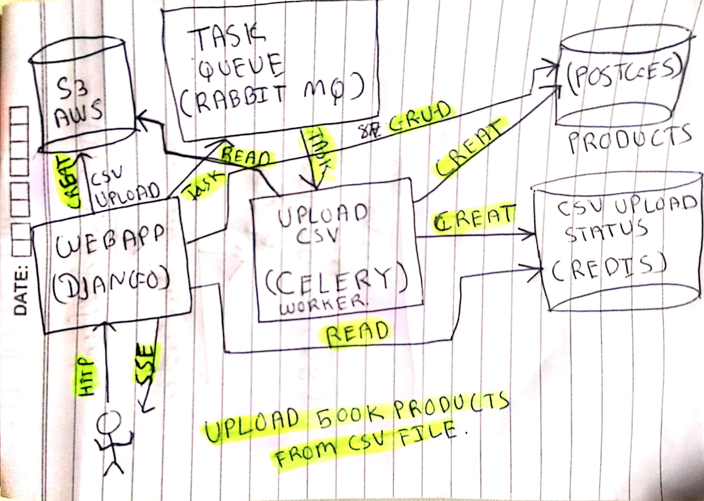

# Narad 📒

## Description

Narad is a product importer service. It is designed to handle constant high
volume upload data.

### Architecture 📜



### Components

* [Django](https://www.djangoproject.com/)
* [Celery](http://www.celeryproject.org/)
* [PostgreSQL](https://www.postgresql.org)
* [Redis](https://redis.io)
* [RabbitMQ](https://www.rabbitmq.com)
* [AWS S3](https://aws.amazon.com/s3/)

### Commands 📦

#### Docker

```
make docker-compose-run
```

Use this command to bootstrap all dependent services like Nginx, Webapp(Django)
and Postgresql. This command internally performs related `docker-compose`
commands.


#### Local Build

```
cp env.copy .env
```

This command is important to perform. This file is an example file for required
environment variables. You have to configure AWS S3 credentials as an
environmnet file.

```
make build
```

This command will install all Python dependencies. You are not re-quired to
perform this command if your goal is to make a build using Docker.

```
make migrations
```

This command will create a database migrations. Make sure PostgresSQL service is
running on configured port.

```
make migrate
```

This command will migrate pending migrations to local data base. Make sure
PostgresSQL service is running on configured port.

```
make run-task-runner
```

This command bootstraps worker process of task runner.

```
make run-webserver
```

This command runs webserver on default port `8000`.
